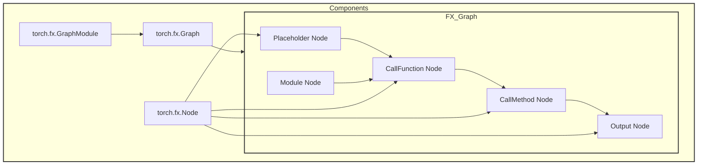

## PyTorch FX 图

> PyTorch FX 是用于捕获、分析和转换 PyTorch 计算图。FX 图是一种静态表示，它记录了 PyTorch 代码的执行流程。用户通过将模型表示为FX图，可以更轻松地进行各种转换，例如图优化，量化，算子融合等。

FX 图的核心组件包括：
- `torch.fx.Graph`：计算图的容器
- `torch.fx.Node`：图中的节点，表示计算操作，如函数调用、方法调用等
- `torch.fx.GraphModule`：由图构建的可执行模块



### FX Symbolic Tracing

FX 图的生成过程称为"符号追踪"（Symbolic Tracing），主要步骤包括：
1. **追踪**：使用 `torch.fx.symbolic_trace()` 对 PyTorch 函数或模块进行追踪
2. **捕获**：捕获函数执行过程中的所有操作，构建计算图
3. **表示**：将计算图表示为 `Graph` 对象，其中包含一系列 `Node` 对象
4. **转换**：对捕获的图进行分析和转换
5. **执行**：将转换后的图包装为 `GraphModule`，可像普通 PyTorch 模块一样执行

```python
import torch


# Simple module for demonstration
class MyModule(torch.nn.Module):
    def __init__(self) -> None:
        super().__init__()
        self.param = torch.nn.Parameter(torch.rand(3, 4))
        self.linear = torch.nn.Linear(4, 5)

    def forward(self, x):
        return self.linear(x + self.param).clamp(min=0.0, max=1.0)


module = MyModule()

from torch.fx import symbolic_trace

# Symbolic tracing frontend - captures the semantics of the module
symbolic_traced: torch.fx.GraphModule = symbolic_trace(module)

# High-level intermediate representation (IR) - Graph representation
# 由一个列表组成 代表函数输入、调用点（函数、方法、 或 torch.nn.Module 实例），以及返回值。
print(symbolic_traced.graph)
"""
graph():
    %x : [num_users=1] = placeholder[target=x]
    %param : [num_users=1] = get_attr[target=param]
    %add : [num_users=1] = call_function[target=operator.add](args = (%x, %param), kwargs = {})
    %linear : [num_users=1] = call_module[target=linear](args = (%add,), kwargs = {})
    %clamp : [num_users=1] = call_method[target=clamp](args = (%linear,), kwargs = {min: 0.0, max: 1.0})
    return clamp
"""

# Code generation - valid Python code
# 使 FX 成为 Python 到 Python（或 模块到模块）转换工具包。对于每个 Graph IR，我们可以 创建与图语义匹配的有效 Python 代码。
print(symbolic_traced.code)
"""
def forward(self, x):
    param = self.param
    add = x + param;  x = param = None
    linear = self.linear(add);  add = None
    clamp = linear.clamp(min = 0.0, max = 1.0);  linear = None
    return clamp
"""
```


FX 图的特点
- **静态分析**：提供了对计算流程的静态视图，便于分析和优化
- **可转换性**：支持对图进行修改和转换，如算子融合、常量折叠等
- **保持语义**：转换后的图与原始代码在功能上等价
- **易于扩展**：提供了丰富的 API 用于图操作和转换

## TorchInductor Pattern Matcher

###  TorchInductor

> TorchInductor 是 PyTorch 2.0+ 引入的新型编译后端，旨在通过图形优化和代码生成显著提升深度学习模型的推理性能。它采用了基于 FX 图的编译策略，将 PyTorch 代码转换为优化后的计算图，然后生成高效的 C++/CUDA 代码。

TorchInductor 的工作流程包括：
1. **FX 图捕获**：使用 FX 符号追踪捕获模型的计算图
2. **图优化**：执行一系列图优化 **passes**，如算子融合、内存优化等
3. **代码生成**：将优化后的图转换为 C++/CUDA 代码
4. **编译执行**：编译生成的代码并执行

### Pattern Matcher

**Pattern Matcher**（模式匹配器）是 TorchInductor 中的核心组件之一，在 Inductor 中，通过查找特定的子图（模式）并将其与替换子图交换来重写 FX 图。 vLLM 将其用于 `RMSNorm + Quant`、`QK Norm + RoPE` 等算子融合操作。基本流程和特点如下：
- **识别特定计算模式**：在 FX 计算图中识别出具有特定结构的子图；
- **执行图优化**：将识别出的子图替换为更高效的实现；
- **支持自定义融合**：允许开发者定义和注册自定义的模式匹配和替换规则；
- **提升计算效率**：通过算子融合等技术减少内存访问和计算开销；

基本概念:
- 模式（Pattern）：一个函数，它定义了要在 FX 图中匹配的子图结构。模式函数通常接受一些输入张量，并执行一系列操作，返回计算结果。
- 替换（Replacement）：一个函数，它定义了在匹配到模式后要执行的替代计算。**替换函数通常接受与模式函数相同的输入，并返回与模式函数相同结构的输出**。
- PatternMatcherPass：PatternMatcherPass 是一个 FX 图遍历器，它负责在图中寻找匹配模式的子图，并执行相应的替换操作。

以下是一个`Rmsnorm + Quant`的示例，初步解释如何注册，以及内部执行Replace的逻辑。


`torch.compile`将Python函数捕获到FX图中，并且Inductor在代码生成前会经过一系列图传递（passes），模式匹配发生在多个阶段（pre-grad/joint and post-grad)），但是大部分融合模式发生在Post-grad阶段，可以在`torch/_inductor/fx_passes/post_grad.py`中查看。
```python
if post_grad_custom_post_pass := config.post_grad_custom_post_pass:
    GraphTransformObserver(gm, "post_grad_custom_post_pass").apply_graph_pass(
        post_grad_custom_post_pass
    )
```
#### Register

TorchInductor 提供了多种模式注册 API
- **low-level API**：
  - `register_graph_pattern`：使用 `CallFunction` 显式构建模式
  - `register_lowering_pattern`：用于注册降低模式
- **high-level API**：
  - `register_replacement`：允许以普通 PyTorch 代码形式编写模式和替换，由 Inductor 自动追踪为 FX 图

vLLM 广泛使用 `register_replacement`，因为它在保持可读性的前提下与原始代码逻辑接近。

```python
def register_replacement(
    pattern: Callable,
    replacement: Callable,
    example_inputs: List[Tensor],
    trace_fn: Callable = fwd_only,
    pm_pass: Optional[PatternMatcherPass] = None,
) -> PatternMatcherPass:
    # 实现细节...
```
参数定义
- `pattern`：定义要匹配的计算模式的函数
- `replacement`：定义替换计算的函数
- `example_inputs`：用于追踪模式和替换函数的示例输入
- `trace_fn`：用于追踪函数生成 FX 图的函数，默认为 `fwd_only`
- `pm_pass`：可选的 PatternMatcherPass 实例，用于存储模式

`register_replacement` 执行流程
1. 使用 `fwd_only` 追踪模式函数，构建一个小的 FX 模式图
2. 通过 `fx_to_pattern` 将 FX 图转换为 `PatternExpr` 树
3. 存储替换函数，供后续追踪使用
4. 在 `apply` 期间，遍历主 FX 图，将每个节点作为模式的输出进行匹配
#### PatternMatcherPass

> PatternMatcherPass会遍历整张图，进行patterns匹配等操作。

```python
class PatternMatcherPass:
    def apply(self, graph: torch.fx.GraphModule) -> int:
        ...
        for node in reversed(graph.nodes):
            target = extract_target(node)
            if (
                node.op in ["call_function", "call_method", "call_module"]
                and target in self.patterns
            ):
                ... # fallback_node_due_to_unsupported_type      
                for entry in self.patterns[target]:
                    if node._erased:
                        break
                    m = entry.pattern.match(node)
                    ... # pattern match crosses mutation barrier - discard
                    if is_match(m) and entry.extra_check(m):
                        count += 1
                        entry.apply(m, graph, node)  # type: ignore[arg-type]
                        ... # counters
```
1. 按 `(node.op, node.target)` 对候选节点进行分组
2. 对每个节点调用 `pattern.match(node)`
3. 匹配过程检查操作和目标，然后递归遍历扁平化的参数结构
4. 每个子节点要么匹配另一个 `PatternExpr`，要么（对于非忽略的字面量）必须匹配精确的常量
5. 匹配器还强制执行重用节点和多用户约束
6. 一旦匹配成功，就使用匹配的输入追踪替换函数，插入新子图，并擦除旧节点
#### `auto_functionalized` 

>auto_functionalized 是一个高阶运算符 (HOP)，用于生成可变自定义运算符的"函数"版本。对于修改张量的自定义操作，`auto_functionalized` 通过将其转换为函数式返回，把副作用显式化，方便编译器在不改变语义的前提下做合法重排，从而解决FX 图需要显式的数据依赖关系。

torch.compile / Inductor 这条编译链路希望看到的是一个functional IR（"**纯函数**"图）：
输入张量不被原地修改，所有状态变化都通过新张量的输出来表达：
- 便于做算子融合、重排等优化；
- 更好地做依赖分析和内存规划

但自定义算子**很多是in‑place**（例如做 KV cache 更新、in‑place 写 view 等）

```python
# 原始操作
foo_inplace(x)    # 修改张量 x
bar_out(x, out)   # 使用修改后的 x，产生 out

# 对应的 FX 图（缺少依赖！）
%x = placeholder()
%out = placeholder()
%foo_result = call_function(foo_inplace, (%x,))
%bar_result = call_function(bar_out, (%x, %out))  # 缺少依赖！

# 使用 auto_functionalized 后的结果
def pattern(...):
    at = auto_functionalized(
        torch.ops.vllm.some_op.default,
        result=result,
        input=input,
        ...
    )
    return at[1], at[2]  # 返回原始返回值和修改后的参数
```


`auto_functionalized` 会克隆mutated_arg，并通过克隆的参数调用op，最终并返回一个元组：

```python
(original_return, mutated_arg1, mutated_arg2, ...)
```

这使得 FX 图中存在显式的数据依赖关系，使模式匹配能够正确工作。
- 在图里插入一个高阶算子 `auto_functionalized`；
	- 先复制所有 mutable 输入；
	- 用这些**拷贝去调用**你原来的 mutable **custom op**；
	- 再把 outputs + mutated copies 全部返回；
- 然后把后续使用原输入的地方全部改成用这些"被改写后的拷贝"。

从编译器视角看，这个算子就变成：  "**纯输入 → 纯输出（包含新的 tensor 状态）**"，整张图就是 functional 的。

## vllm 实现 Pattern Matcher 

vllm 通过以下类对 TorchInductor Pattern Matcher 进行了封装

###  `VllmPatternMatcherPass`

> 继承自 `VllmInductorPass`，提供了模式注册、匹配计数、调试信息输出等功能

```python
class VllmPatternMatcherPass(VllmInductorPass):
    matched_count: int = 0
    match_table: ClassVar[defaultdict[str, int]] = defaultdict(int)
    
    def dump_patterns(self, config: VllmConfig, pm_pass: PatternMatcherPass) -> None:
        # 输出模式调试信息
```

### `VllmFusionPatternMatcherPass`

> 继承自 `VllmPatternMatcherPass`，使用 `VllmPatternReplacement` 对象进行模式注册。

```python
class VllmFusionPatternMatcherPass(VllmPatternMatcherPass):
    def __init__(self, config: VllmConfig, pass_name: str) -> None:
        super().__init__(config)
        self.pm_pass = PatternMatcherPass(pass_name=pass_name)
        
    def register(self, pr: VllmPatternReplacement) -> None:
        pm.register_replacement(
            pr.pattern,
            pr.replacement,
            pr.get_inputs(),
            self._trace_fn,
            self.pm_pass,
        )
```

### MiniMax QK Norm Fusion

以 `minimax_qk_norm_fusion.py` 为例，在 MiniMax 模型的推理过程中，QK 计算包含多个步骤：
1. 将 QKV 张量分割为 Q、K、V 三个部分
2. 将 Q 和 K 转换为 float32 精度
3. 计算 Q 和 K 的方差
4. 将方差进行 AllReduce 操作
5. 计算 RMS 归一化
6. 应用权重并转换回原始精度

这些操作在解码阶段会被频繁执行，成为性能瓶颈。vllm 使用 Pattern Matcher 识别上述计算模式，并将其替换为一个融合的内核 `minimax_allreduce_rms_qk`，从而能够更高效地执行这些操作。vllm-ascend中通过Patch实现`MiniMaxM2Attention.forward = _patch_forward`

#### 模式定义

```python
def pattern(
    qkv: torch.Tensor,
    q_weight: torch.Tensor,
    k_weight: torch.Tensor,
) -> tuple[torch.Tensor, torch.Tensor, torch.Tensor]:
	# 分割 QKV
	q, k, v = qkv.split([q_size, kv_size, kv_size], dim=-1)
	# 转换精度
	q_fp32 = q.to(torch.float32)
	k_fp32 = k.to(torch.float32)
	# 计算方差
	q_var = q_fp32.pow(2).mean(dim=-1, keepdim=True)
	k_var = k_fp32.pow(2).mean(dim=-1, keepdim=True)
	# 拼接方差
	qk_var = torch.cat([q_var, k_var], dim=-1)
	# AllReduce 操作
	qk_var = tensor_model_parallel_all_reduce(qk_var) / tp_world
	# 分割方差
	q_var, k_var = qk_var.chunk(2, dim=-1)
	# 归一化和应用权重
	q_out = (q_fp32 * torch.rsqrt(q_var + eps) * q_weight).to(dtype)
	k_out = (k_fp32 * torch.rsqrt(k_var + eps) * k_weight).to(dtype)
	return q_out, k_out, v
```

模式匹配要求
- **操作类型和目标必须匹配**：模式中的 `(node.op, node.target)` 必须与目标图中的节点完全匹配
- **参数结构必须匹配**：参数的数量和结构必须一致
- **占位符变为** **`KeywordArg`**：占位符名称成为匹配对象中的关键字键
	- 写 `KeywordArg("alpha")`，匹配的目标里就要有 `kwargs["alpha"]`;
- **`Arg()`** **和** **`KeywordArg()`** **匹配任何内容**：它们是模式的叶子，将匹配的节点绑定到结果 `Match` 中
- **`Ignored()`** **可用于忽略某些子参数**：Inductor 在构造模式时也会使用它来忽略常量
	- Inductor 在自动构造某些模式（比如对某些 fused op 的 pattern）时，会把固定、无关紧要的常量参数（比如某些 layout / dtype flag、常量 scaling factor）直接标记为 `Ignored()`

#### 替换定义

```python
def replacement(
    qkv: torch.Tensor,
    q_weight: torch.Tensor,
    k_weight: torch.Tensor,
) -> tuple[torch.Tensor, torch.Tensor, torch.Tensor]:
    assert _MINIMAX_QK_NORM_FUSED_OP is not None
    # 调用融合内核
    q_out, k_out = torch.ops.vllm.minimax_qk_norm_fused(
        qkv,
        q_weight,
        k_weight,
        q_size,
        kv_size,
        tp_rank,
        tp_world,
        eps,
        max_tokens,
    )
    _, _, v = qkv.split([q_size, kv_size, kv_size], dim=-1)
    return q_out, k_out, v
```

#### 模式注册

```python
pm.register_replacement(
    pattern, replacement, self.get_inputs(), pm.fwd_only, pm_pass
)
```


#### MiniMaxQKNormPass
```python
class MiniMaxQKNormPass(VllmPatternMatcherPass):
	def __init__(self, config: VllmConfig) -> None:
		self.patterns: PatternMatcherPass = PatternMatcherPass(
            pass_name="minimax_qk_norm_pass"
        )
        self._register_patterns(q_size, kv_size, eps, tp_world, tp_rank)
        self.dump_patterns(config, self.patterns)
        self.disabled = False
	def _register_patterns(...):
	    MiniMaxQKNormPattern(
            q_size=q_size,
            kv_size=kv_size,
            eps=eps,
            tp_world=tp_world,
            tp_rank=tp_rank,
            max_tokens=self.max_token_num,
            dtype=self.model_dtype,
            device=self.device,
        ).register(self.patterns)
        
    def is_applicable_for_range(self, compile_range: Range) -> bool:
        if self.disabled:
            return False
		# 控制适用条件
        return bool(compile_range.end <= self.max_token_num)
```

完整执行过程
1. **初始化**：在 `MiniMaxQKNormPass.__init__` 中，检查融合内核是否可用，获取模型参数和并行配置
2. **模式注册**：调用 `_register_patterns` 方法注册模式
3. **应用传递**：在 `__call__` 方法中，应用模式匹配和替换
4. **匹配计数**：记录匹配和替换的次数，用于调试和性能分析

通过将多个操作融合到一个内核中，MiniMax QK Norm Fusion 带来性能提升
- **减少内存访问**：避免了中间结果的存储和读取
- **减少内核启动开销**：将多个内核调用合并为一个
- **优化并行通信**：使用 Lamport 算法更高效地执行 AllReduce 操作
- **提高计算效率**：在单个内核中执行多个操作，减少了线程同步开销

### vllm其他算子融合场景
- **QK Norm RoPE Fusion**：融合 QK 归一化和 RoPE 操作
- **RoPE KV Cache Fusion**：融合 RoPE 和 KV Cache 访问
- **RMS Quant Fusion**：融合 RMS 归一化和量化操作
- **Attention Quant Fusion**：融合注意力计算和量化操作
- **AllReduce RMS Fusion**：融合 AllReduce 和 RMS 归一化
- **Activation Quant Fusion**：融合激活函数和量化操作

## 参考
1. https://docs.pytorch.org/docs/stable/fx.html
2. https://karthick.ai/blog/2026/Learn-By-Doing-Torchinductor-Pattern-Matcher/
